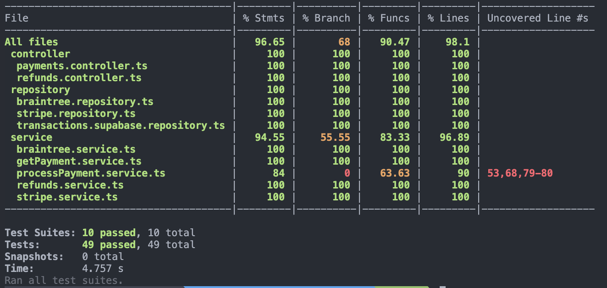

## Malga API Pay - Solução de Pagamentos para Checkout

<p align="center">
  <a href="http://nestjs.com/" target="blank"></a>
</p>

[circleci-image]: https://img.shields.io/circleci/build/github/nestjs/nest/master?token=abc123def456
[circleci-url]: https://circleci.com/gh/nestjs/nest

  <p align="center">A progressive <a href="http://nodejs.org" target="_blank">Node.js</a> framework for building efficient and scalable server-side applications.</p>
    <p align="center">
<a href="https://www.npmjs.com/~nestjscore" target="_blank"></a>
<a href="https://www.npmjs.com/~nestjscore" target="_blank"></a>
<a href="https://www.npmjs.com/~nestjscore" target="_blank"></a>
<a href="https://circleci.com/gh/nestjs/nest" target="_blank"></a>
<a href="https://coveralls.io/github/nestjs/nest?branch=master" target="_blank"></a>
<a href="https://discord.gg/G7Qnnhy" target="_blank"></a>
<a href="https://opencollective.com/nest#backer" target="_blank"></a>
<a href="https://opencollective.com/nest#sponsor" target="_blank"></a>
  <a href="https://paypal.me/kamilmysliwiec" target="_blank"></a>
    <a href="https://opencollective.com/nest#sponsor"  target="_blank"></a>
  <a href="https://twitter.com/nestframework" target="_blank"></a>
</p>
  <!--[](https://opencollective.com/nest#backer)
  [](https://opencollective.com/nest#sponsor)-->

## Descrição

A API Pay é uma solução de gateway de pagamentos desenvolvida para e-commerces. A aplicação processa pagamentos de forma resiliente, alternando automaticamente entre dois provedores de pagamento externos simulados (Stripe e Braintree) em caso de falhas. Além disso, inclui endpoints opcionais para estornos e consultas de transações.

## Tecnlogias Utilizadas

- Linguagem: **TypeScript**
- Framework: **NestJS**
- Mock dos Provedores: **Feito manualmente na aplicação.**
- Banco de Dados: **Supabase**
- Resiliência: **Circuit Breaker (opossum)**
- Testes: **Jest para testes unitários.**

## Documentação

Dentro da estrutura do projeto foi adicionado uma pasta docs/collections onde tem a collection com todos endpoints disponiveis na aplicação.

E na raiz do aplicativo esta disponivel um swagger com todos os endpoints documentados.

Collection Folder: /docs/collections/
Swagger File: ./api-pay-swagger-v1.yaml

- **Collection Folder**: `/docs/collections/`
- **Swagger File**: `/api-pay-swagger-v1.yaml`

## Instalação

```bash
$ npm install
```

## Rodando o aplicativo

```bash
# watch mode
$ npm run start:dev
```

## Como Validar a Resiliência ?

Foi desenvolvido um endpoint responsável por gerenciar e alterar os estados de variáveis armazenadas em memória.

Essa funcionalidade é implementada por meio de uma classe Singleton, garantindo que as variáveis estejam disponíveis de forma centralizada e acessível para toda a aplicação. Essa abordagem permite modificar dinamicamente os estados dessas variáveis em tempo de execução, oferecendo uma capacidade de simulação real de cenários com circuit breaker.

Para mais duvidas esse endpoint esta listado no swagger e tambem estou disponibilizando o postman com chamadas possiveis .

<b>Curl do endpoint</b>

```Curl
curl --location 'http://localhost:3000/flag/state' \
--header 'Content-Type: application/json' \
--data '{
  "key": "braintree",
  "value": false
}'
```

| Variável                    | Tipo      | Valor Padrão | Descrição                                                                                  |
| --------------------------- | --------- | ------------ | ------------------------------------------------------------------------------------------ |
| `stripe`                    | `boolean` | true         | Responsável por ativar ou desativar o provedor Stripe. Inicia como `true` na aplicação.    |
| `braintree`                 | `boolean` | true         | Responsável por ativar ou desativar o provedor Braintree. Inicia como `true` na aplicação. |
| `stripe_response_status`    | `boolean` | true         | Simula a resposta do Stripe com status `failed` durante o processamento do pagamento.      |
| `braintree_response_status` | `boolean` | true         | Simula a resposta do Braintree com status `failed` durante o processamento do pagamento.   |

## Test



```bash
# test coverage
$ npm run test:cov
```

## Desenvolvido por

- Author - [Dennis Quintal]()

## Licença

Nest is [MIT licensed](LICENSE).
